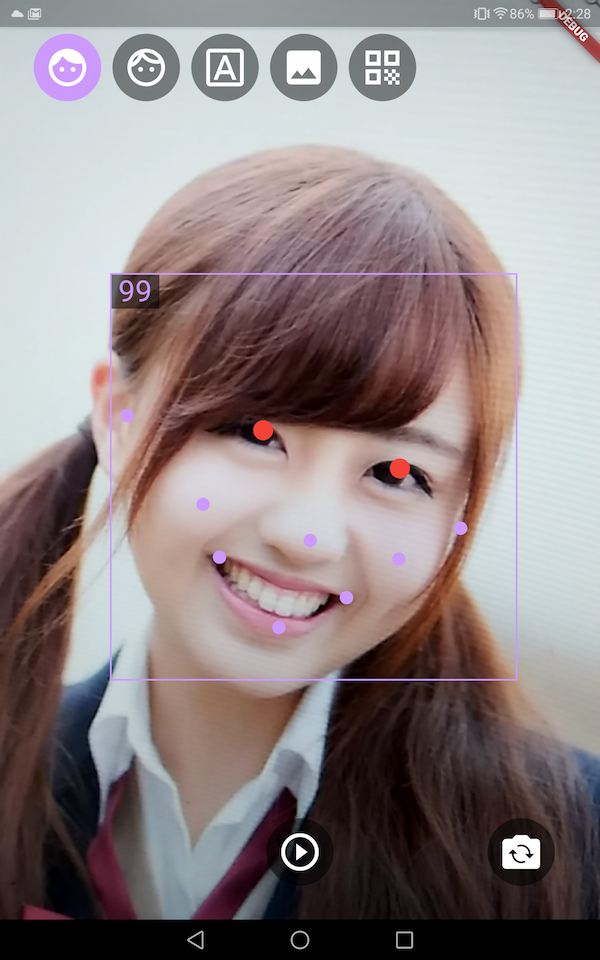
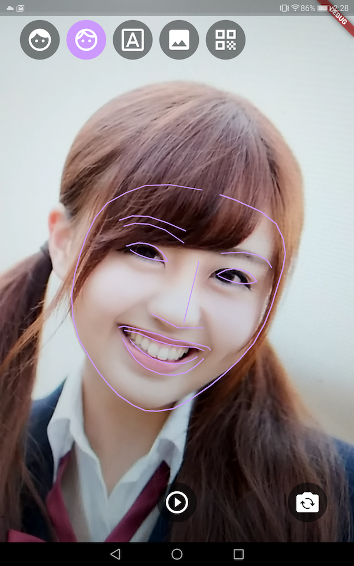
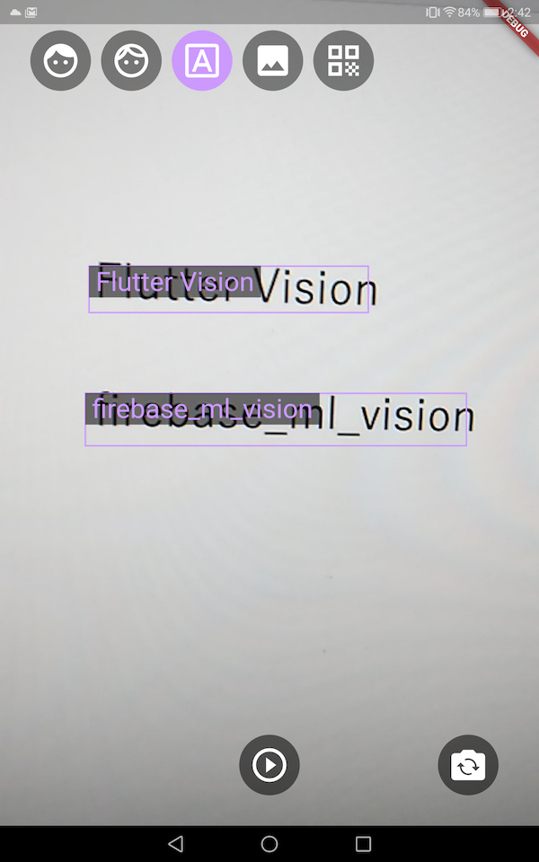
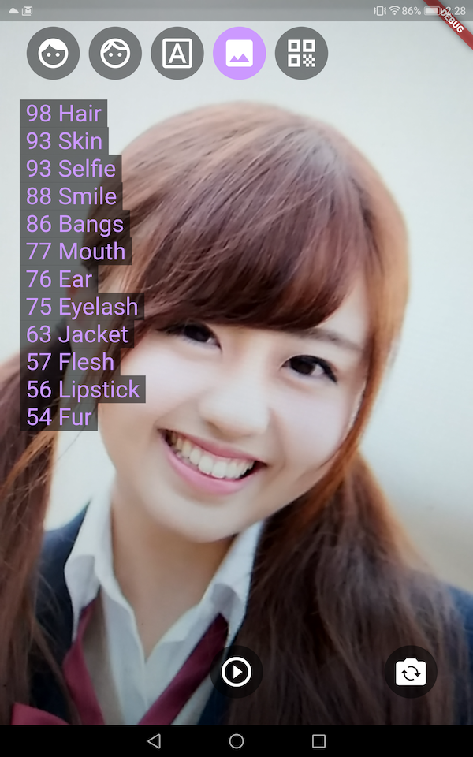
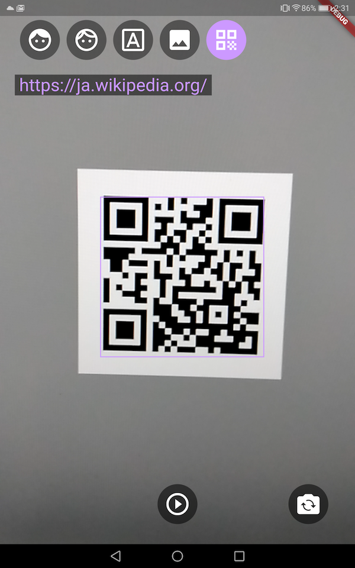

# Flutter Vision

## Overview
This app uses Flutter and firebase_ml_vision.

## Screen

<table>
<tr>
<td>Face Landmarks 

<td>Face Contours 

<td>TextRecognizer 

<tr><td>ImageLabeler 

<td>BarcodeDetector 

<td>&nbsp;
</table>
