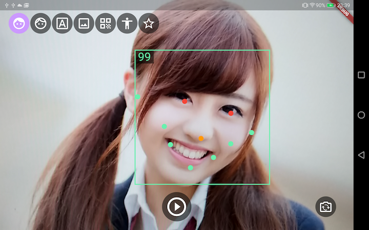
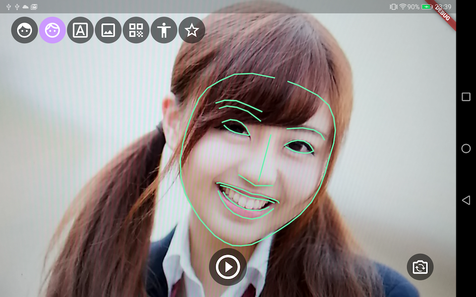
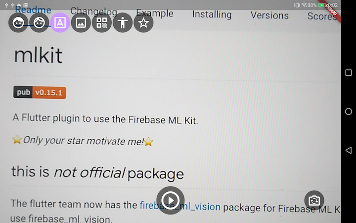
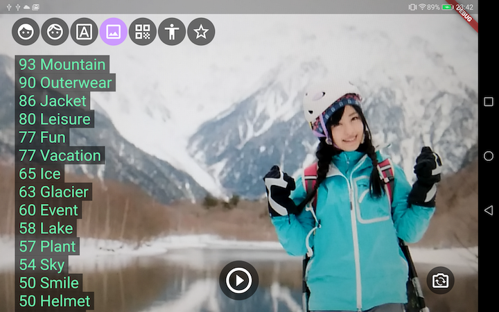
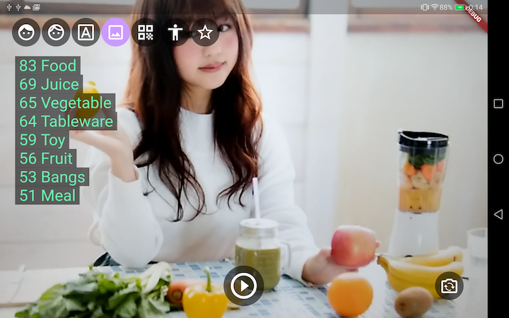
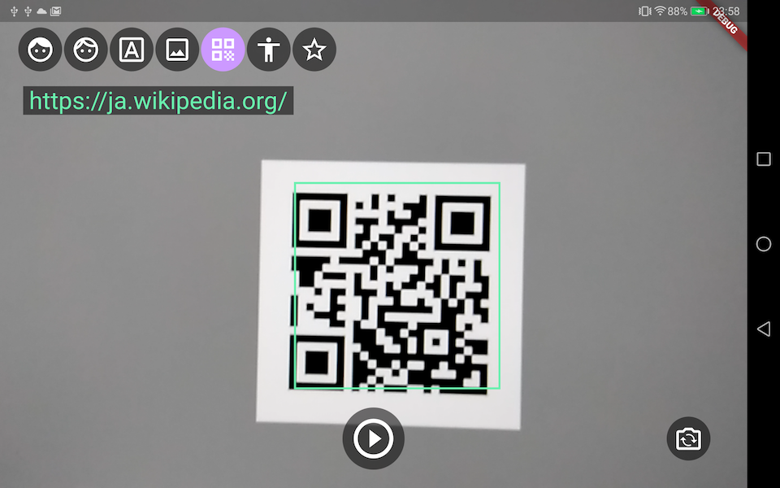
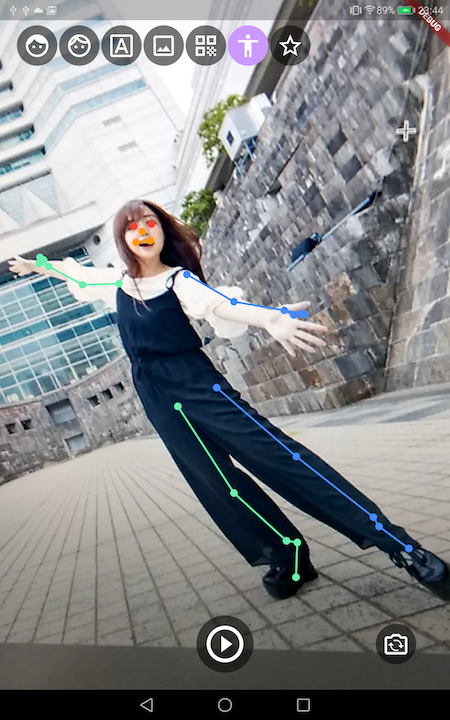
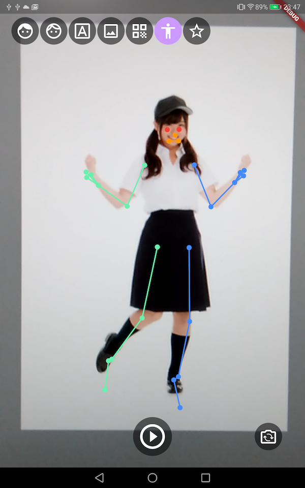
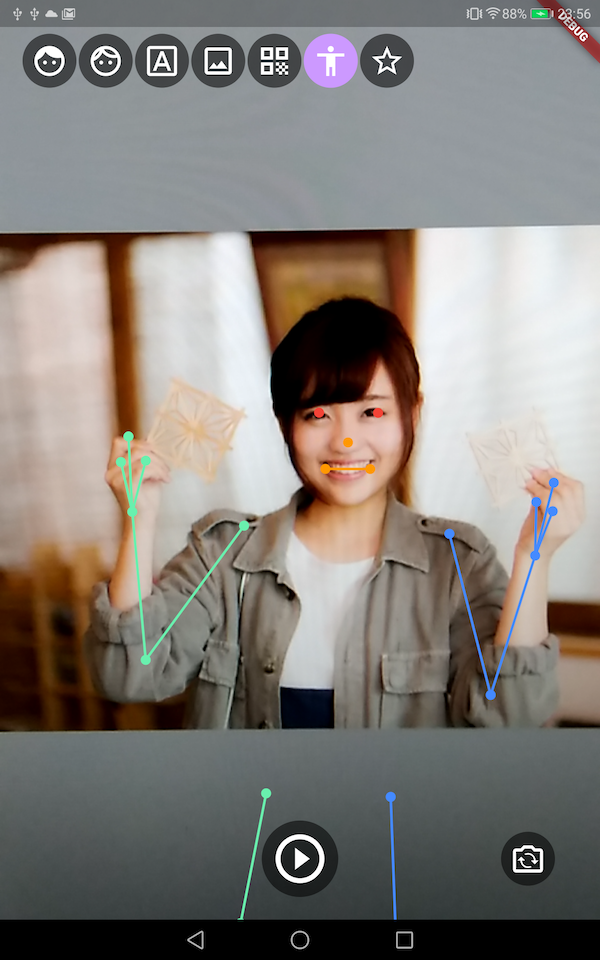

# Flutter Vision

## Overview
This app uses Flutter and Google ML Kit.

## Screen

### :large_blue_diamond: Face Landmarks

### :large_blue_diamond: Face Contours

### :large_blue_diamond: TextRecognizer
 

### :large_blue_diamond: ImageLabeler
 

### :large_blue_diamond: BarcodeDetector

### :large_blue_diamond: PoseDetector
  
