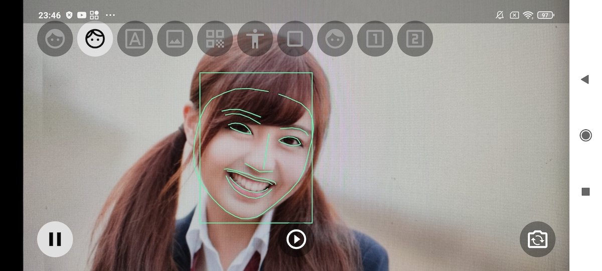
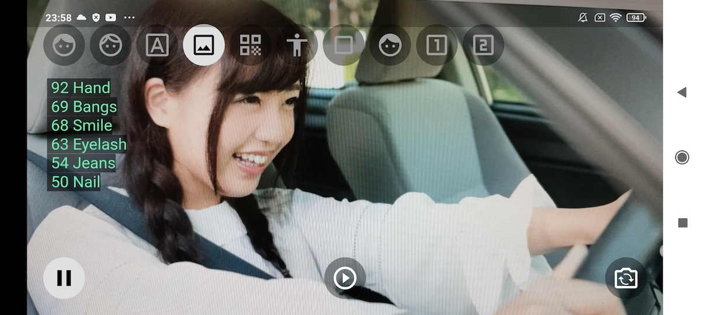
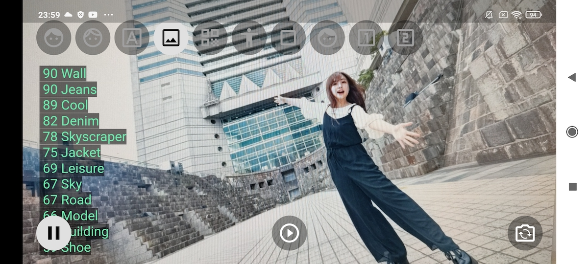
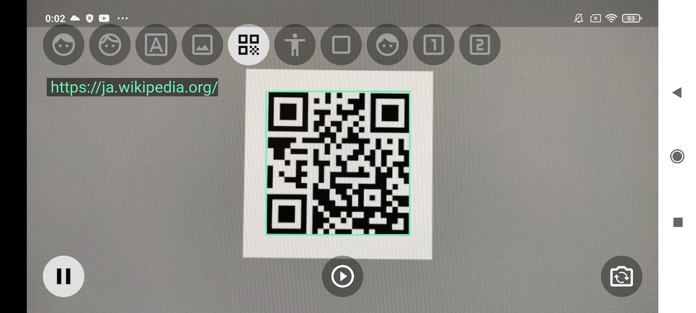
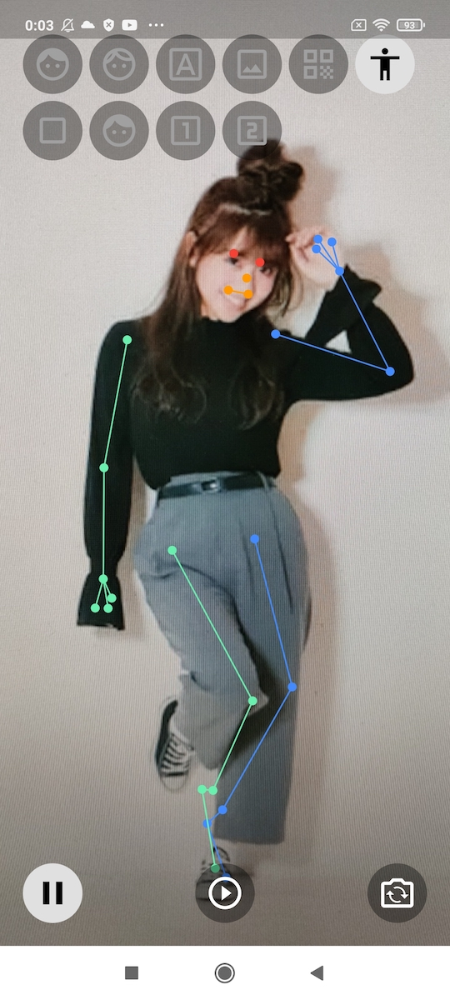
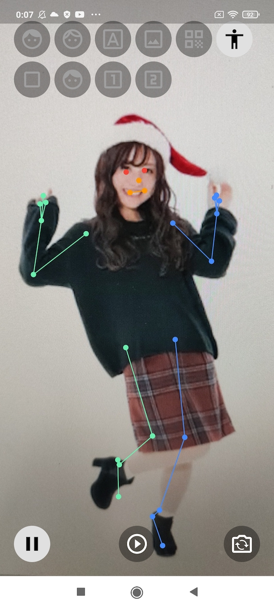

# Flutter Vision

## :blue_book: Overview
This app uses Flutter and Google ML Kit and TensorFlow Lite.

## :blue_book: Screen

### Face Detector


### Text Recognizer
 

### Image Labeler
 

### Barcode Detector


### Pose Detector
  

### TensorFlow Lite (Custom model)

## :blue_book: You need to get the file

### 1 Create a project in Firebase
https://console.firebase.google.com/u/0/

### 2 Download file 
google-services.json (android)
GoogleService-Info.plist (ios)

### 3 Add file to project
FlutterVision (project)  
:file_folder:android  
&emsp;:file_folder:gradle  
&emsp;:open_file_folder:app  
&emsp;&emsp;:file_folder:build  
&emsp;&emsp;:file_folder:src  
&emsp;&emsp;:notebook:build.gradle  
&emsp;&emsp;:notebook:google-service.json :arrow_left:  
:file_folder:ios  
&emsp;:file_folder:Flutter  
&emsp;:file_folder:Runner  
&emsp;&emsp;:file_folder:Assets.xcaseets  
&emsp;&emsp;:file_folder:Base.lpoj  
&emsp;&emsp;:notebook:AppDelegate.swift  
&emsp;&emsp;:notebook:GoogleService-Info.plist :arrow_left:  
&emsp;&emsp;:notebook:Info.plist  

## :blue_book: Creating a model with Tensorflow Lite

### Run python

```python:main.py
# pip install tensorflow
# pip install tflite-model-maker

import os
import numpy as np
import tensorflow as tf
 
from tflite_model_maker import model_spec
from tflite_model_maker import image_classifier
from tflite_model_maker.config import ExportFormat
from tflite_model_maker.config import QuantizationConfig
from tflite_model_maker.image_classifier import DataLoader
import matplotlib.pyplot as plt

data = DataLoader.from_folder('train/')
train_data, test_data = data.split(0.9)
model = image_classifier.create(train_data)
loss, accuracy = model.evaluate(test_data)

model.export(export_dir='.')
model.export(export_dir='.', export_format=ExportFormat.LABEL)
```

### Add it to pubspec.yaml

```yaml:pubspec.yaml
flutter:
  assets:
    - assets/model.tflite  ←Add
    - assets/labels.txt  ←Add
```
